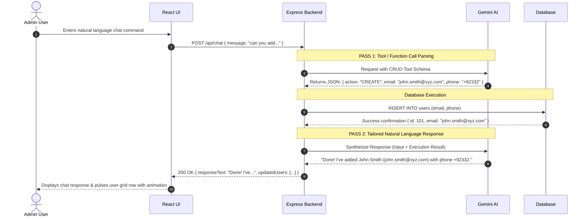

# AI Chatbot Master Plan & Architecture Blueprint (WPBrigade Task)

> **Project Goal**: Build an operational AI-powered Chatbot that lets admins add, update, and delete user records using natural language chat commands. Designed for high-grade Full-Stack & UI/UX evaluation.

---

## 1. System Architecture Overview

The system uses a **Single SPA Web Application Architecture** built on the **R.I.O.T** pattern (React + Express + Gemini AI Integration).

```
┌─────────────────────────────────────────────────────────────────────────┐
│                           REACT CLIENT (Vite)                           │
│  ┌────────────────────────┐ ┌──────────────────────┐ ┌───────────────┐  │
│  │ Auto-Login Auth Modal  │ │ User Table (Center)  │ │ AI Chat Panel │  │
│  └────────────────────────┘ └──────────────────────┘ └───────────────┘  │
└────────────────────────────────────┬────────────────────────────────────┘
                                     │ HTTP / REST API Calls (/api/chat, /api/users)
                                     ▼
┌─────────────────────────────────────────────────────────────────────────┐
│                         EXPRESS SERVER (Backend)                        │
│  ┌────────────────────────┐ ┌──────────────────────┐ ┌───────────────┐  │
│  │ Auth & Validation      │ │ Database Store (SQL) │ │ AI Service    │  │
│  └────────────────────────┘ └──────────────────────┘ └───────────────┘  │
└────────────────────────────────────┬────────────────────────────────────┘
                                     │ Native Function Calling / Tool Use
                                     ▼
┌─────────────────────────────────────────────────────────────────────────┐
│                              GEMINI AI API                              │
│         - Tool Schema: { action: "CREATE|UPDATE|DELETE", data }         │
└─────────────────────────────────────────────────────────────────────────┘
```

---

## 2. Directory Structure (R.I.O.T Pattern)

```
chatbot-wipro/
├── client/                 # React Frontend (Vite)
│   ├── src/
│   │   ├── components/    # UserTable, ChatDrawer, LoginModal, AuditLogs
│   │   ├── pages/         # Dashboard Page
│   │   ├── services/      # api.js (Axios/Fetch API client)
│   │   ├── App.jsx
│   │   ├── index.css      # Dark Mode Design System
│   │   └── main.jsx
│   ├── package.json
│   └── vite.config.js
├── server/                 # Express Backend
│   ├── config/            # DB setup (SQLite / In-Memory Store)
│   ├── controllers/       # chatController.js, userController.js
│   ├── middleware/        # authMiddleware.js, errorHandler.js
│   ├── routes/            # chatRoutes.js, userRoutes.js, authRoutes.js
│   ├── services/          # geminiService.js, userService.js
│   ├── index.js           # Express App Entrypoint
│   └── package.json
├── start-all.ps1           # Unified launch script for Windows
└── README.md               # Evaluator installation & launch instructions
```

---

## 3. Data Flow & Two-Pass AI Pipeline

When an admin enters a command such as:  
*`"can you add the user john.smith@xyz.com with phone number +92332"`*



---

## 4. Key UI/UX Features (Showcase Checklist)

1. **Auto-Login Modal**: Validates registered admin emails (e.g. `test06.wpbrigade@gmail.com`).
2. **Split-Screen Layout**:
   - **Left Navigation**: Logo ("AI Chatbot"), Audit Logs toggle.
   - **Center Panel**: Dynamic user table (`Avatar`, `Email`, `Phone`, `City`, `Status`).
   - **Right Panel**: Glassmorphism AI Chat Assistant with quick prompt chips.
3. **Live UI Mutation Sync**: Reactive grid updates with CSS pulse highlight animations whenever a user is added/updated/deleted.
4. **Audit Logs Drawer**: Inspect behind-the-scenes JSON schemas sent between Express and Gemini.

---

## 5. Setup & Launch Instructions for AntiGravity IDE

### Step 1: Create Directories
```powershell
mkdir chatbot-wipro
cd chatbot-wipro
mkdir client, server
mkdir client/src, client/src/components, client/src/pages, client/src/services
mkdir server/config, server/controllers, server/middleware, server/routes, server/services
```

### Step 2: Key Dependencies
- **Server (`server/package.json`)**: `express`, `@google/genai` (or `@google/generative-ai`), `dotenv`, `cors`, `better-sqlite3` (or in-memory store).
- **Client (`client/package.json`)**: `react`, `react-dom`, `vite`, `lucide-react`.

---

## 6. Target Test Commands to Verify
- `can you add the user "john.smith@xyz.com" with phone number "+92332"`
- `can you remove the user "john.smith@xyz.com"`
- `can you update samanthas city to Cordoba`
